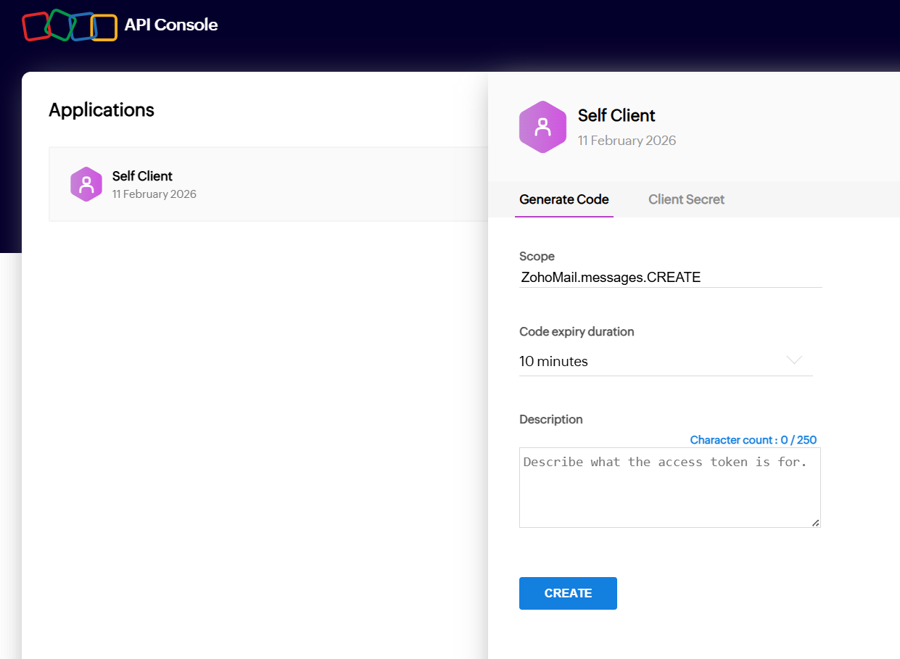
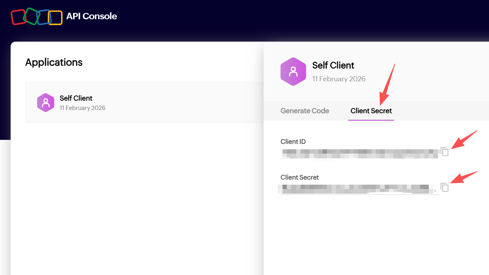

# Zoho Outreach Automation Agent

Automated email draft creation and sending pipeline using Zoho Mail API.

## Features

- Generate personalized email drafts from Excel contact list
- Create Zoho drafts via API
- Optional send automation
- OAuth token exchange helpers

## Project Structure
- auto_outreach.py: Main automation script
- zoho_mail.py: Zoho Mail API client
- exchange_token.py: OAuth token exchange
- get_account_id.py: Retrieve Zoho account ID
- examples/: Sample data for testing

## Setup

### 1. Clone

```bash
git clone https://github.com/YOUR_USERNAME/REPO_NAME.git
cd REPO_NAME
```

### 2. Create virtual environment
```bash
python -m venv .venv
source .venv/bin/activate
```
### 3. Install dependencies
```bash
pip install -r requirements.txt
```
### 4. Configure environment variables

Create a .env file in the project root:
```bash
ZOHO_CLIENT_ID=
ZOHO_CLIENT_SECRET=
ZOHO_REFRESH_TOKEN=
ZOHO_ACCOUNT_ID=
```
### 5. Run
```bash
python auto_outreach.py
```
This will create a folder named 'outreach_output' under your current directory. It contains an Excel file and text file, where you can preview the message. The text file will look strange if you use HTML format in the auto_outreach.py, it is fine, the correct format will be visible in the next step.
After initial checking, run:
```bash
python test_zoho_draft.py
```
This will generate all the emails included in your email_list Excel file in the Zoho draft folder. I recommend to send out the created drafts manually, becuase when I auto send all, some emails get returned for no reason.

- The attachment function is limited, maybe due to API attachment uploads are disabled for our Zoho account. So, either manually add the attachment, or include attachment as a link in the text to acheive faster email generation.
### Note
Delete the files in the outreach_output folder before you want to create a new batch of emails.

### Example
A sample contact list structure is available in:
```bash
examples/sample_email_list.xlsx
```
## Installation Guide (For First-Time Users)
If you are not familiar with coding, follow these steps carefully. If you are familiar, jump to next part.
---

### Step 1 - Install Python

1. Go to:  
   https://www.python.org/downloads/

2. Click **Download Python 3.x**

3. Run the installer.

⚠️ VERY IMPORTANT:  
On the first screen, check the box:

☑️ **Add Python to PATH**

Then click **Install Now**.

After installation, open Command Prompt (Windows) or Terminal (Mac) and run:

```bash
python --version
```
You should see something like:
```bash
Python 3.12.x
```
### Step 2 - Install Visual Studio Code (VS Code)
1. Go to:
https://code.visualstudio.com/

2. Click Download for Windows (or Mac)

3. Run the installer with default settings.
### Step 3 - Install Required VS Code Extensions

1. Open VS Code.

2. Click the Extensions icon (left sidebar)

3. Search for:

- Python

4. Click Install

This allows VS Code to run Python properly.
### Step 4 - Download This Project

1. Go to this repository on GitHub.

2. Click the green Code button.

3. Click Download ZIP.

4. Extract the ZIP file to your computer.

5. Open the extracted folder in VS Code.
### Step 5 - Open the Project in VS Code

1. Open VS Code

2. Click File → Open Folder

3. Select the project folder

4. Open it
### Step 6 - Open Terminal Inside VS Code
Terminal → New Terminal, and  you can type command in the terminal
## Zoho API Setup 
### Overview

Each teammate needs their own Zoho OAuth credentials (refresh token) because the drafts will be created under their Zoho email account. Zoho uses OAuth2, where we exchange a one-time grant token (authorization code) for a long-lived refresh token, then use the refresh token to get short-lived access tokens automatically.
### 1) Create a Zoho “Self Client” (one-time per person)

1. Go to Zoho API Console (Zoho calls this registering the client application).

2. Create a Self Client.

3. Copy down:

- Client ID

- Client Secret
### 2) Generate a Grant Token (Authorization Code)
 
In the Zoho API Console → your Self Client → Generate Code:

- Scope: ZohoMail.messages.CREATE 

 Generate the code and copy the Grant Token (it expires quickly).

 ### 3) Use exchange_token.py to get Refresh Token + Access Token

In this repo, run:
```bash
python exchange_token.py --grant_token YOUR_GRANT_TOKEN --client_id YOUR_CLIENT_ID --client_secret YOUR_CLIENT_SECRET
```
This script calls Zoho’s token endpoint ({Accounts_URL}/oauth/v2/token) to exchange the authorization code for tokens. Zoho recommends sending these values in the POST body.

####  Output will include:

- access_token (short-lived)

- refresh_token (save this — long-lived)
### Get your Zoho Mail Account ID

Run:
```bash
python get_account_id.py
```
Copy the printed accountId.

### 5) Create your .env file (for every user)

Each user creates their own .env file in the project root:
```bash
ZOHO_CLIENT_ID=xxxxx
ZOHO_CLIENT_SECRET=xxxxx
ZOHO_REFRESH_TOKEN=xxxxx
ZOHO_ACCOUNT_ID=xxxxx
```
Now the scripts will authenticate as that user.
### 6) Test
Enter your own emails in the email_list, use any message you want in the auto_outreach.py
Run:
```bash
python auto_outreach.py
python test_zoho_draft.py